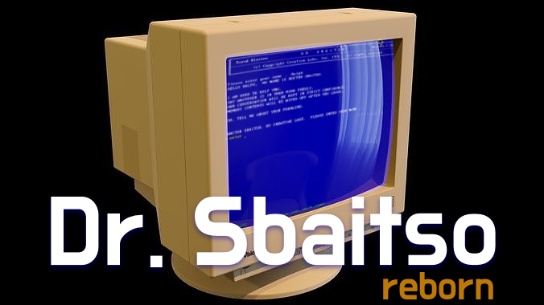

# Dr. Sbaitso: Reborn
**Welcome to 2024 Dr. Sbaitso. We've been waiting for you.**  
An unofficial, fan-made modern recreation for retro-computing enthusiasts.

  

#
HELLO `<YOUR NAME HERE>`, MY NAME IS DOCTOR SBAITSO.

I AM HERE TO HELP YOU. 
SAY WHATEVER IS IN YOUR MIND FREELY, 
OUR CONVERSATION WILL BE KEPT IN STRICT CONFIDENCE. 
MEMORY CONTENTS WILL BE WIPED OFF AFTER YOU LEAVE, 

SO, TELL ME ABOUT YOUR PROBLEMS.

#

A front-end for Dr. Sbaitso created in `Zig` and `Raylib 5.5`: For modern Desktops as a standalone application.

For historical context on what Dr. Sbaitso is [read the wikipedia article](https://en.wikipedia.org/wiki/Dr._Sbaitso).

This will not run without the backend-system which I have not made public yet as it needs more work.
This version of Dr. Sbaitso is intended to build just enough of this version that it is nearly
indistinguishable from the original however it will never be an exact clone.

Additionally, I will eventually build a plugin system for swapping out the voice synthesis with other
systems. And furthermore a plugin system for having a true AI powered backend (such as ChatGPT) to control 
the good Dr.'s mind.

While I don't antcipate this project to be terribly complex it should offer a good example of how to use true
native OS threading in a GUI-based application such as Raylib. All cross-thread communication happens via
the use of thread-safe queues. Anything that potentially blocks the Raylib event loop will occur in an auxillary
thread. Additionally, should an auxillary thread need to communicate back to the main Raylib thread there is
a "main thread" dispatcher to handle this.

## Current Features
1. The Dr.'s **original** voice
2. A native app: No DosBox, DosBox-X, DosBox-Staging, FreeDOS, VirtualBox or x86-Box required!
2. Faithful recreation of the Dr.'s Turbo C DOS environment
3. All of the Dr's original text-to-speech responses
4. Ability to change background color, font, forground color
5. More to come...

## How it works

1. When running in default mode, the game loads up a `.json` definition file of responses
2. These responses were harvested from the original's binary and should be nearly accurate.
3. Like the original, the app announces the `Creative Labs` banner, asks for the user's name and
   greets the user with the canonical introduction.
4. At this point, the user can type any questions or statements to kick off the conversation.
5. Upon submitting a statement or question, the app will attempt to match the user's input with
   an appropriate response. Responses are not random but round-robin like the original. This simple
   idea mitigates the end-user from having to hear too many repeated responses.
6. If the user repeats what they typed in, a special response category is used taunting the user
   about saying the same thing twice. There are actually two categories for this.
7. If the user enters garbage like: `@als398$#$#%`, a response category for garbage input is used.
   Detecting garbage is not as straightforward as you would think, so this isn't done yet.
8. If the user curses; (bad words), the app will chastise the user or potentially go into `parity`
   error mode like the original Dr. Sbaitso app did. Parity mode is what happens when the Dr. 
   refuses to process your disgusting filth!
9. If still no response is found, a category of *generic* fallback responses will be used to move the
   conversation forward and encourage dialog between the user and the good Doctor.
10. Finally, when a valid response is selected the app will dispatch the text to the speech-synthesis
   engine in a dedicated thread where it will immediately be heard by the end user's audio output and the matching text rendered to the screen.

## Enhancements
- [ ] Modernized, newer canned responses to make Dr. Sbaitso aware of current times.
    He will know about new things like: Tik-Tok, Harry Styles and Texting.
- [ ] Ability to change background color, font color, font style
- [x] Ability to enable/disable CRT shader, or enable/disable CRT monitor border
- [x] Ability to compute the `md5` or `sha1` hash of whatever you type in using the `.md5` or `.sha1` commands.
- [x] Ability say anything using the `.say` command.
- [x] Ability say something in reverse using the `.rev` command.
- [x] Ability to read any file word for word using the `.read` command.
- [ ] Ability to swap speech-synthesis backends
- [ ] Ability to adjust prosody and or tone, volume, pitch, speed of speech engine
- [ ] Ability to plugin in an AI brain like ChatGPT, or other systems
- [ ] Various easter-eggs, retro-computing references, etc
- [ ] The Dr. may become impatient if you don't say anything after awhile.
- [ ] Ask him to tell you a joke!

## Credits
* [CRT Monitor Graphic - by Halfingr](https://www.deviantart.com/halfingr/art/Vectorized-CRT-Monitor-Stock-PNG-292314284)

## Observations
1. If he asks for an age: "ARE YOU SERIOUS? HOW OLD ARE YOU?", any user repsponse will be followed up with
   something like: "WAIT A FEW MORE YEARS, KID" even you type a non integer response. If you type an age: 77 you'll get 
   "I PREFER SOMEONE YOUNGER".
2. In the strings dump of sbaitso.exe some responses are pre-quoted like: "`2TOO LITTLE DATA, SO I MAKE BIG" this causes
   them to follow up with something special like:
   * 1 => Give user ability to <C>ontinue <N>ew patient <Q>uit ....
   * 2 => Adjust screen to 40 characters per line instead of the normal 80
   * 3 => Change the color
   * 4 => Do an age challenge
   * Parity is not included in this list, but that's the only other easter egg.

## Building
* Currently requires zig `0.14.0`
* Using regular zig: `zig build run`
* Using zigup: `zigup run 0.14.0 build run`

## Big fat caveat
* I have not released the speech engine...so this repo, as-is won't quite work!